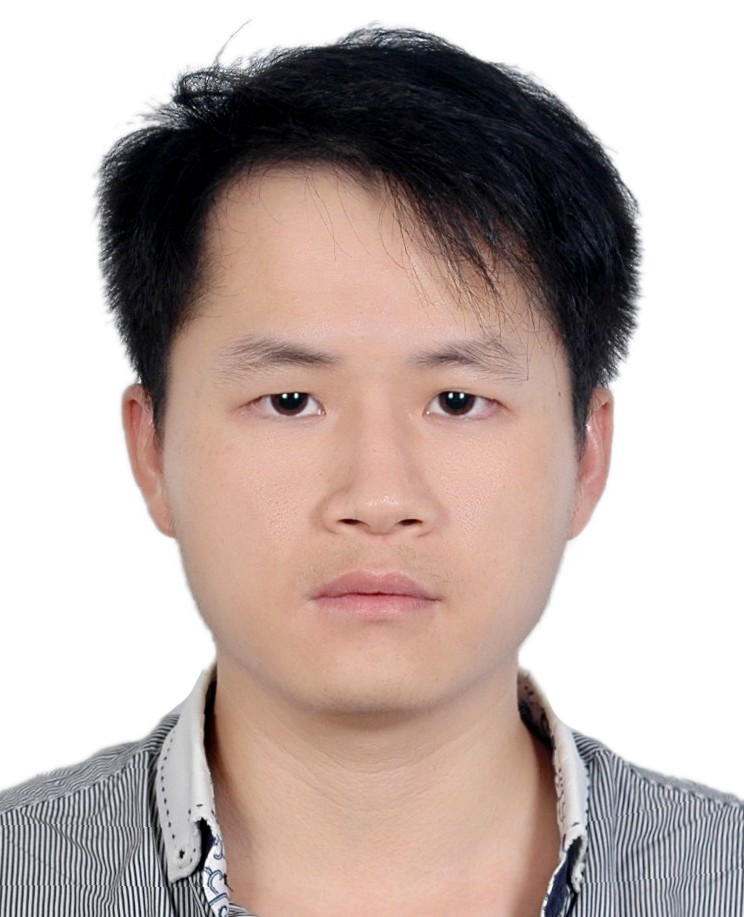

## Dr. Qingling Zhu

* Position: Assistant Professor
* Affiliation:
[National Engineering Laboratory for Big Data System Computing Technology](https://bdsc.szu.edu.cn/), [Shenzhen University](https://www.szu.edu.cn/), Shenzhen, China, Shenzhen University, China
* Address: 3688 Nanhai Avenue, Nanshan District, Shenzhen
* E-mail: zhuqingling [at] szu.edu.cn; zhuqingling [at] email.szu.edu.cn; ql.zhu@qq.com
* [Google Scholar](https://scholar.google.com/citations?user=oN-GBWoAAAAJ&hl=en)

## Short Biography

I am currently a Assistant Professor at the National Engineering Laboratory for Big Data System Computing Technology, Shenzhen University (SZU). Before that, I obtained Ph.D degree in City University in HongKong, in July 2021, under the supervision of [Prof. Qingfu Zhang](http://www.cs.cityu.edu.hk/~qzhan7/index.html). In addition, I received the B.S. degrees in Engineering from Shenzhen University (SZU) in 2016. During 2016 to 2017, I was a Research Assistant at Shenzhen University with [Dr. Qiuzhen Lin](http://csse.szu.edu.cn/csse.szu.edu.cn/cn/people1bbd.html?30298).

## Research Interest

Computational Intelligence, Evolutionary Computation, Multi-Objective Optimization, Machine Learning

## Work Experience

* 2016 Jul ~ 2017 Sep
  * Research Assistant
  * College of Computer Science and Software Engineering,
  * Shenzhen University
  * with [Dr. Qiuzhen Lin](http://csse.szu.edu.cn/csse.szu.edu.cn/cn/people1bbd.html?30298).
* 2021 Jul ~ 2023 Oct
  * Pos Doc
  * College of Computer Science and Software Engineering,
  * Shenzhen University
* 2023 Nov ~ Now
  * Assistant Professor
  * National Engineering Laboratory for Big Data System Computing Technology,
  * Shenzhen University
  * with [Prof. Jianqiang Li](https://bdsc.szu.edu.cn/index.html#/h5/h?id=114&p=2004&f=53&lan=zh) and [Prof. Qiuzhen Lin](http://csse.szu.edu.cn/csse.szu.edu.cn/cn/people1bbd.html?30298)
## Education

* 2017 Sep ~ 2021 Jul
  * Ph.D.
  * Department of Computer Science
  * City University of Hong Kong
<!--  * Thesis: Many-Objective Evolutionary Optimization: Theory and Method (in Chinese) -->
* 2013 Sep ~ 2016 Jun
  * Master
  * College of Computer Science and Software Engineering
  * Shenzhen University
* 2009 Sep ~ 2013 Jun
  * Bachelor of Engineering
  * School of Information Engineering
  * Nanchang Institude Technology
## Publications

### Refereed Journal Papers
* 2023 
  * Xiaoqiang Wu, **Qingling Zhu**, Qiuzhen Lin, Weineng Chen, Jianqiang Li, Adaptive Evolutionary Reinforcement Learning Algorithm with Early Termination Strategy, AAMAS 2024, Accepted.
  * **Qingling Zhu**, Xiaoqiang Wu, Qiuzhen Lin, Wei-Neng Chen, Two-Stage Evolutionary Reinforcement Learning for Enhancing Exploration and Exploitation, AAAI 2024, Accepted.
  * **Qingling Zhu**, Xiaoqiang Wu, Qiuzhen Lin, Lijia Ma, Jianqiang Li, Zhong Ming, Jianyong Chen, A survey on evolutionary reinforcement learning algorithms,Neurocomputing, 2023, 556:126628.
  * Jianqiang Li, Junchuang Cai, Tao Sun, **Qingling Zhu**, Qiuzhen Lin, Multitask-Based Evolutionary Optimization for Vehicle Routing Problems in Autonomous Transportation, IEEE Transactions on Automation Science and Engineering, 2023, Early Accepted.

* 2022
  * Junchuang Cai, **Qingling Zhu**, Qiuzhen Lin, Variable neighborhood search for a new practical dynamic pickup and delivery problem, Swarm and Evolutionary Computation, 2022, 75:101182.

* 2020
  * **Qingling Zhu**, Qingfu Zhang, Qiuzhen Lin, **A Constrained Multiobjective Evolutionary Algorithm with Detect-and-Escape Strategy**, IEEE Transactions on Evolutionary Computation, 2020, 24(5):938-947.
  The source code can be downloaded from <a href="https://github.com/zhuqingling/MOEA-D-DAE">here</a>.

* 2019

  * **Qingling Zhu**, Qiuzhen Lin, Jianqiang Li, Carlos A. Coello Coello, Jianyong Chen, and Jun Zhang **An Elite Gene Guided Reproduction Operator for Many-objective Optimization**, 2019, 51(2):765-778.
  The source code can be downloaded from <a href="https://github.com/zhuqingling/EGG">here</a>.
  
* 2018
  
  * Qiuzhen Lin, **Qingling Zhu (corresponding author)**, Na Wang, Peizhi Huang, Wenjun Wang, Jianyong Chen, Zhong Ming. **A multi-objective immune algorithm with dynamic population strategy.** Swarm and Evolutionary Computation, Early Access, DOI:10.1016/j.swevo.2018.12.003.
  
  * **Qingling Zhu**, Qiuzhen Lin, Jianyong Chen. **A gene-level hybrid search framework for multiobjective evolutionary optimization.** Neural Computing and Applications, 2018, 30(3):759-773.

  * Qiuzhen Lin, Yueping Ma, Jianyong Chen, **Qingling Zhu**,  Carlos A. Coello Coello, Ka-Chun Wong, Fei Chen. **An adaptive immune-inspired multi-objective algorithm with multiple differential evolution strategies.** Information Sciences. 2018, 430:46-64.
	
  * Qiuzhen Lin, Songbai Liu, **Qingling Zhu**, Chaoyu Tang, Ruizhen Song, Jianyong Chen, Carlos A. Coello Coello, Ka-Chun Wong, Jun Zhang. **Particle swarm optimization with a balanceable fitness estimation for many-objective optimization problems.** IEEE Transactions on Evolutionary Computation. 2018, 22(1):32-46.

* 2017

  * **Qingling Zhu**, Qiuzhen Lin, Weineng Chen, Ka-Chun Wong, Carlos A. Coello Coello, Jianqiang Li, Jianyong Chen, Jun Zhang. **An external archive-guided multiobjective particle swarm optimization algorithm.** IEEE Transactions on Cybernetics, 2017, 47(9): 2794-2808.
    * The source code can be downloaded from <a href="https://github.com/zhuqingling/AgMOPSO.git">here</a>.

* 2016

  * **Qingling Zhu**, Qiuzhen Lin, Zhihua Du, Zhengping Liang, Wenjun Wang, Zhexuan Zhu, Jianyong Chen, Peizhi Huang, Zhong Ming. **A novel adaptive hybrid crossover operator for multiobjective evolutionary algorithm.** Information Science, 2016, 345:177-198.
    * The source code can be downloaded from <a href="https://github.com/zhuqingling/ADE-MOIA.git">here</a>.

* 2015

  * Qiuzhen Lin, **Qingling Zhu**, Peizhi Huang, Jianyong Chen, Zhong Ming, Jianping Yu. **A novel hybrid multi-objective immune algorithm with adaptive differential evolution.** Computers & Operations Research, 2015, 62:95-111.

### Refereed Conference Papers

* 2019

  * **Qingling Zhu**, Qingfu Zhang, Qiuzhen Lin, Jianyong Sun, **MOEA/D with Two Types of Weight Vectors for Handling Constraints**
, CEC 2019.

* 2017

  * **Qingling Zhu**, Qiuzhen Lin, Jianyong Chen.  **An elite archive-based MOEA/D Algorithm.** Asia-Pacific Conference on Simulated Evolution and Learning (SEAL 2017), 236-247.

* 2015
  
  * **Qingling Zhu**, Qiuzhen Lin, Jianyong Chen, Peizhi Huang. **A gene-level hybrid crossover operator for multiobjective evolutionary algorithm.** Soft Computing and Machine Intelligence (ISCMI 2015), 20-24.

### Awards
* Gold Price in ICAPS 2021 Huawei Competition on Dynamic Pickup And Delivery Problem, 2021 (USD \$5000)

* Gold Price in EMO 2021 HUAWEI Logistics Competition, 2021 (USD \$5000)

* 2019 Research Tuition Scholarship of City University of Hong Kong

* 2019 Outstanding Academic Performance Award

* 2018 Research Tuition Scholarship of City University of Hong Kong

* 2018 Outstanding Academic Performance Award

## Activities

### Reviewer of Journals
  * IEEE Transactions on Evolutionary Computation
  * IEEE Transactions on Cybernetics
  * Applied Soft Computating
  * Swarm and Evolutionary Computation

##### Last update: Jan 06, 2022
